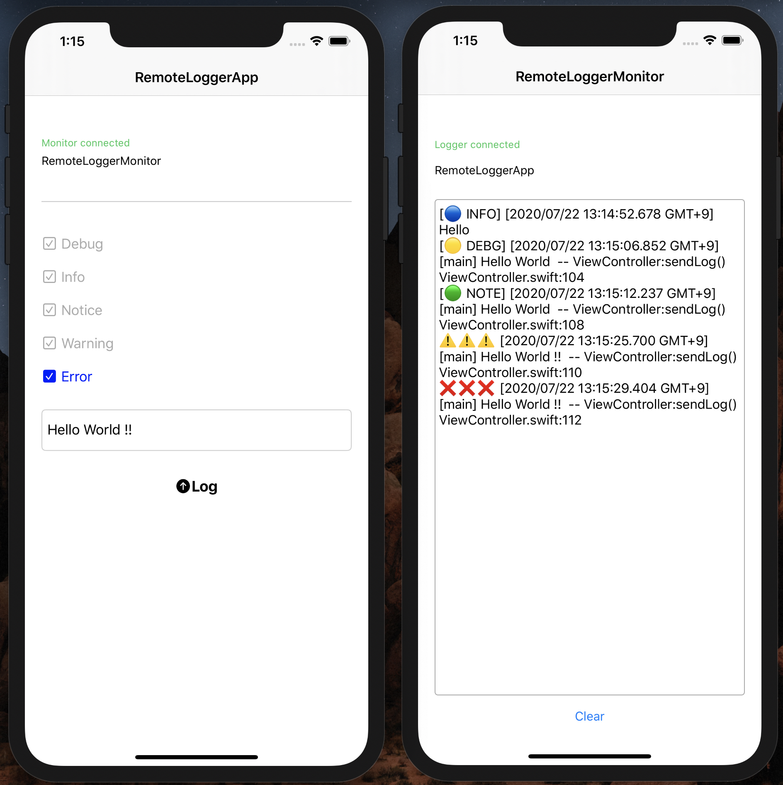

# RemoteLogger

 [](https://raw.githubusercontent.com/Carthage/Carthage/master/LICENSE.md)

**RemoteLogger is the logging tool for output log to the another device through local network**

It means you can see your app's log on a real iPhone/iPad device by another one at anywhere if they are in the same local network.





## Restriction

RemoteLogger works only after iOS13 since it uses Network Framework.

The network core modules described below come from [Apple's example](https://developer.apple.com/documentation/network/building_a_custom_peer-to-peer_protocol). So if you use this code, you must comply with the [license](.//Sources/RemoteLogger/LocalNetworkTools/LICENSE.txt)

```

├── Sources
    └── RemoteLogger
        ├── LocalNetworkTools
        │   ├── NWParameters+TLS.swift
        │   ├── NetworkAdvertiser.swift
        │   ├── NetworkBrowser.swift
        │   └── NetworkConnection.swift
        └── RemoteLoggerCore
            └── RemoteLoggerProtocol.swift
```


## How to use package

### Logging

Let's see class RemoteLogger.swift in RemoteLoggerApp for example

```swift

// 1) import RemoteLogger package

import RemoteLogger

// 2) create a RemoteLoggerManager

monitor = RemoteLoggerManager.shared

// 3) start browsing monitor. and if find it with autoConnect == true, RemoteLoggerManager automatically connect it

manager.browseAdvertiser(delegate: self, autoConnect: true, passcode: "PASSCODE", receiveDelegate: nil)

// 4) just send log message you want with sendLog()

manager.sendLog(formattedMessage)

```

### Monitoring

Let's see class RemoteLoggerMonitor.swift in RemoteLoggerMonitor for example

```swift

// 1) import RemoteLogger package

import RemoteLogger

// 2) create a RemoteLoggerManager

monitor = RemoteLoggerManager.shared

// 3) start to advertise monitor for RemoteLogger. advertisingName is anything ok, passcode needs to be same as RemoteLogger's one

monitor.startAdvertiser(advertisingName: "RemoteLoggerMonitor", passcode: "PASSCODE", receiveDelegate: self)

// 4) you have to implement RemoteLoggerReceiveDelegate

extension RemoteLoggerMonitor: RemoteLoggerReceiveDelegate {

    public func ready(_ sender: RemoteLoggerManager) {}

    public func failed(_ sender: RemoteLoggerManager) {}

    public func received(_ sender: RemoteLoggerManager, log: String?) {
        guard let log = log else { return }

        // log is sent from RemoteLogger
        print("🍎 \(log)")
    }

    public func received(_ sender: RemoteLoggerManager, control: String?) {
        guard let control = control else { return }

        // control is sent from RemoteLogger
        print("🍏 \(control)")
    }
}

```

### Detail

The codes in NetworkTools folder are quite common codes. They does not depend on RemoteLogger. They are just codes for networking with Apple's Network Framework.

log and control String appeared in

`func received(_ sender: RemoteLoggerManager, log: String?)`
`func received(_ sender: RemoteLoggerManager, control: String?)`

are defined in RemoteLoggerProtocol.swift

RemoteLoggerManager and RemoteLoggerProtocol are for RemoteLogger library.

if you change RemoteLoggerProtocol, you can use thease codes for another purpose.


## How to use it in App

If you'd like to use RemoteLogger as is.
RemoteLogger.swift in RemoteLoggerApp folder and RemoteLoggerMonitor.swift in RemoteLoggerMonitor folder are very useful.

RemoteLogger.swift describes how to use RemoteLogger package with Logger package and PPubliser package. 
Actually you don't need to use Logger package and PPubliser package, but it is useful to know how to handle RemoteLogger package.

### Logger package

it provides logging api for app

### PPubliser package

it provides publish and subscribe api for app
